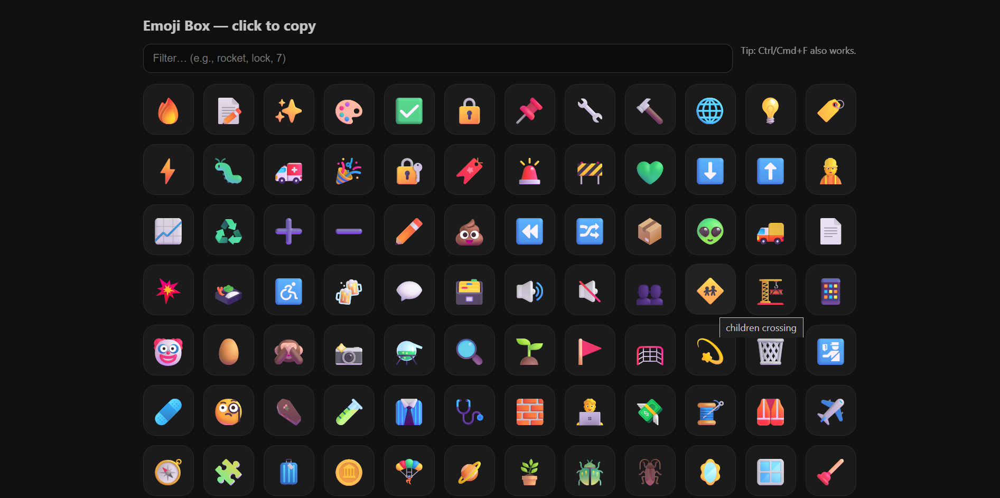
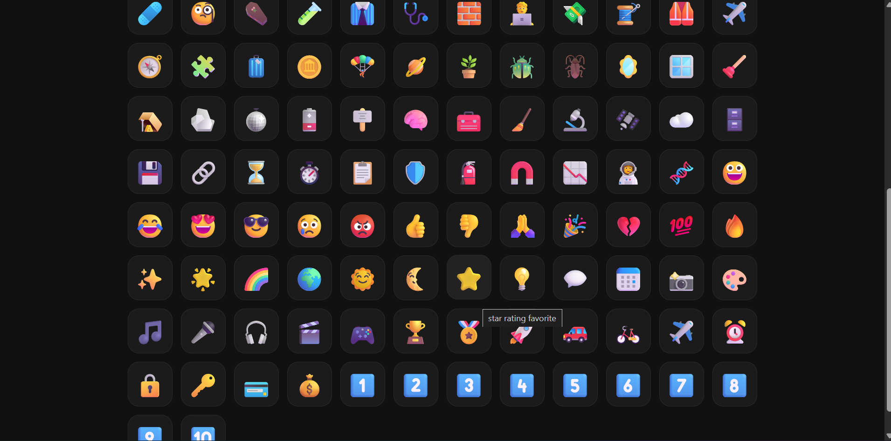

# Emoji Box 🌟

100+ clean emojis in one box.  
Drop the HTML, open, click, copy. Done.  

---

## Features
- 🎨 **100+ Emojis** – neat, copy-ready collection  
- ⚡ **One-click Copy** – just tap an emoji  
- 🔍 **Search Box** – find what you need fast  
- 🖥️ **Resizable UI** – Max button + fullscreen toggle  
- 🚀 **No Install** – works fully offline, just double-click `index.html`  

---

## How to Use
1. Open **`index.html`** in your browser (double-click it).  
2. Click any emoji → copied instantly.  
3. Use the search bar to filter.  
4. Hit **M/Max** or ⛶ to resize/fullscreen.  
5. (Optional) Right-click → *Add to Desktop* for quick launch.  

---

## Screenshots
*(from `/assets` folder)*  

### Main Interface

---

## Credits
Built as a one-prompt Cursor test.  
Turned into a handy little tool. Enjoy! 💥
