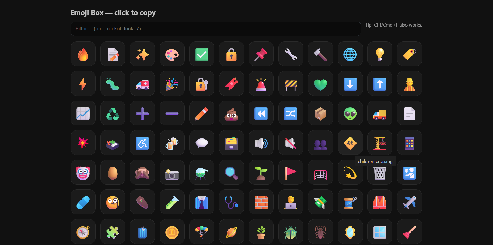
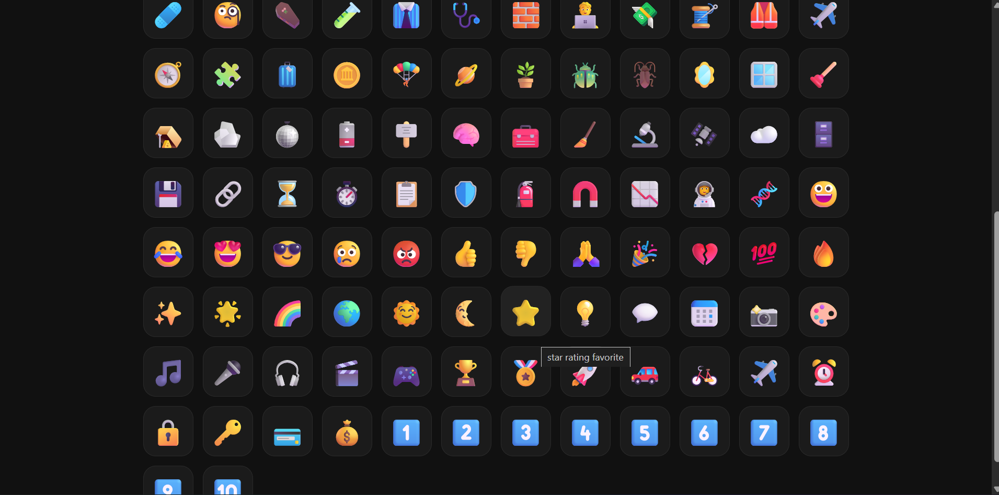

# Emoji Box – Screenshots

This folder contains preview images for the **Emoji Box** project.  
Use them in the main README to show how the app looks in action.

---

## Preview

### Main Interface


### One-Click Copy


---

📌 Tip: To display these in your main README, use relative paths like:

```md

